# College Chatbot System Architecture Block Diagram

## System Overview
This diagram shows the complete architecture of the Cllg Chatbot system, including frontend, backend, AI processing, data storage, and external integrations.

```mermaid
graph TB
    %% User Interface Layer
    subgraph "Frontend Layer"
        UI[User Interface<br/>index.html]
        AdminUI[Admin Dashboard<br/>admin.html]
        CSS[Styles<br/>styles.css]
        JS[Client Scripts<br/>script.js, admin.js]
    end

    %% Web Server Layer
    subgraph "Web Server Layer"
        Flask[Flask Application<br/>app.py]
        CORS[CORS Middleware]
        Routes[API Routes<br/>api.py]
    end

    %% Core AI Processing
    subgraph "AI Core Layer"
        AI[CollegeAI Class<br/>ai.py]
        KB[Knowledge Base<br/>Built-in Categories]
        AdminKB[Admin Knowledge<br/>Custom Entries]
        Tokenizer[Text Tokenizer]
        Matcher[Keyword Matcher]
        Scorer[Response Scorer]
    end

    %% Data Storage Layer
    subgraph "Data Storage Layer"
        Storage[Storage Module<br/>storage.py]
        KnowledgeFile[knowledge.json<br/>Admin Knowledge]
        LocationsFile[locations.json<br/>Campus Locations]
        UploadDir[uploads/<br/>PDF Files]
        Config[config.py<br/>System Configuration]
    end

    %% External Services
    subgraph "External Services"
        GoogleMaps[Google Maps API<br/>Directions & Navigation]
        Geolocation[Browser Geolocation<br/>User Location]
        PDFExtract[PyPDF2<br/>PDF Text Extraction]
    end

    %% API Endpoints
    subgraph "API Endpoints"
        ChatAPI["/api/chat<br/>POST - Send Messages"]
        KnowledgeAPI["/api/knowledge<br/>GET/POST/PUT/DELETE"]
        PDFAPI["/api/knowledge/pdf<br/>POST - Upload PDFs"]
        LocationsAPI["/api/locations<br/>GET/POST/PUT/DELETE"]
        HealthAPI["/api/health<br/>GET - Health Check"]
        StatsAPI["/api/stats<br/>GET - Usage Statistics"]
    end

    %% Data Flow Connections
    UI --> Flask
    AdminUI --> Flask
    CSS --> UI
    CSS --> AdminUI
    JS --> UI
    JS --> AdminUI

    Flask --> CORS
    Flask --> Routes
    Routes --> ChatAPI
    Routes --> KnowledgeAPI
    Routes --> PDFAPI
    Routes --> LocationsAPI
    Routes --> HealthAPI
    Routes --> StatsAPI

    ChatAPI --> AI
    KnowledgeAPI --> AI
    PDFAPI --> AI
    LocationsAPI --> Storage

    AI --> KB
    AI --> AdminKB
    AI --> Tokenizer
    AI --> Matcher
    AI --> Scorer

    Storage --> KnowledgeFile
    Storage --> LocationsFile
    Storage --> UploadDir
    Storage --> Config

    PDFAPI --> PDFExtract
    PDFExtract --> UploadDir
    PDFExtract --> KnowledgeFile

    UI --> GoogleMaps
    UI --> Geolocation
    AdminUI --> GoogleMaps

    %% Knowledge Base Categories
    subgraph "Built-in Knowledge Categories"
        Admission[Admission Requirements]
        Courses[Course Information]
        Financial[Financial Aid]
        Library[Library Services]
        Campus[Campus Services]
        StudentLife[Student Life]
        Tech[Technical Support]
        Calendar[Academic Calendar]
        Housing[Housing Information]
        Parking[Parking & Transportation]
    end

    KB --> Admission
    KB --> Courses
    KB --> Financial
    KB --> Library
    KB --> Campus
    KB --> StudentLife
    KB --> Tech
    KB --> Calendar
    KB --> Housing
    KB --> Parking

    %% Response Processing Flow
    subgraph "Response Processing Flow"
        UserInput[User Input Message]
        Tokenize[Tokenize & Clean Text]
        MatchKeywords[Match Keywords]
        ScoreResponses[Score Response Matches]
        SelectResponse[Select Best Response]
        FormatResponse[Format Response]
        ReturnResponse[Return to User]
    end

    UserInput --> Tokenize
    Tokenize --> MatchKeywords
    MatchKeywords --> ScoreResponses
    ScoreResponses --> SelectResponse
    SelectResponse --> FormatResponse
    FormatResponse --> ReturnResponse

    %% Admin Features
    subgraph "Admin Features"
        AddKnowledge[Add Knowledge Entries]
        EditKnowledge[Edit Knowledge Entries]
        DeleteKnowledge[Delete Knowledge Entries]
        UploadPDF[Upload PDF Documents]
        ManageLocations[Manage Campus Locations]
        ViewStats[View Usage Statistics]
    end

    AdminUI --> AddKnowledge
    AdminUI --> EditKnowledge
    AdminUI --> DeleteKnowledge
    AdminUI --> UploadPDF
    AdminUI --> ManageLocations
    AdminUI --> ViewStats

    AddKnowledge --> KnowledgeFile
    EditKnowledge --> KnowledgeFile
    DeleteKnowledge --> KnowledgeFile
    UploadPDF --> UploadDir
    ManageLocations --> LocationsFile
    ViewStats --> AI

    %% Styling
    classDef frontend fill:#e1f5fe
    classDef backend fill:#f3e5f5
    classDef ai fill:#e8f5e8
    classDef storage fill:#fff3e0
    classDef external fill:#fce4ec
    classDef api fill:#f1f8e9

    class UI,AdminUI,CSS,JS frontend
    class Flask,CORS,Routes backend
    class AI,KB,AdminKB,Tokenizer,Matcher,Scorer ai
    class Storage,KnowledgeFile,LocationsFile,UploadDir,Config storage
    class GoogleMaps,Geolocation,PDFExtract external
    class ChatAPI,KnowledgeAPI,PDFAPI,LocationsAPI,HealthAPI,StatsAPI api
```

## Key Components Description

### Frontend Layer
- **User Interface (index.html)**: Main chatbot interface with chat messages, quick actions, and directions widget
- **Admin Dashboard (admin.html)**: Administrative interface for managing knowledge base and locations
- **Client Scripts**: JavaScript for chat functionality, admin operations, and location services

### Web Server Layer
- **Flask Application**: Main web server handling HTTP requests and responses
- **CORS Middleware**: Enables cross-origin requests for API access
- **API Routes**: RESTful endpoints for different system functions

### AI Core Layer
- **CollegeAI Class**: Main AI processing engine with conversation management
- **Knowledge Base**: Built-in categories covering all college-related topics
- **Admin Knowledge**: Custom knowledge entries added by administrators
- **Text Processing**: Tokenization, keyword matching, and response scoring

### Data Storage Layer
- **JSON Files**: Persistent storage for knowledge entries and locations
- **Upload Directory**: Storage for PDF documents and other files
- **Configuration**: System settings and college-specific information

### External Services
- **Google Maps Integration**: Provides directions and navigation services
- **PDF Processing**: Extracts text from uploaded PDF documents
- **Geolocation**: Uses browser location for personalized directions

## Data Flow

1. **User Interaction**: User sends message through web interface
2. **Request Processing**: Flask receives and routes the request to appropriate API endpoint
3. **AI Processing**: CollegeAI processes the message using keyword matching and scoring
4. **Response Generation**: Best matching response is selected and formatted
5. **Response Delivery**: Formatted response is sent back to user interface
6. **Location Services**: If location-related, integrates with Google Maps for directions

## Admin Features

- **Knowledge Management**: Add, edit, delete custom knowledge entries
- **PDF Upload**: Upload and process PDF documents into knowledge base
- **Location Management**: Manage campus locations for directions feature
- **Statistics**: View usage statistics and conversation history

This architecture provides a scalable, maintainable chatbot system specifically designed for college student assistance with comprehensive knowledge management capabilities.
